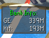
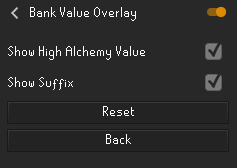
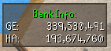
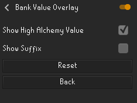

# Bank Value Overlay Plugin
Calculates your entire character's bank and displays the overall GE and High Alchemy of your bank on the screen as an overlay.

## Configuartion options

### Show High Alchemy Value
If unchecked, the plugin will remove the High Alchemy from the overlay.

### Show Suffix
If unchecked, the plugin will remove the K/M/B suffix from the bank value and displays a more precise value.

 

